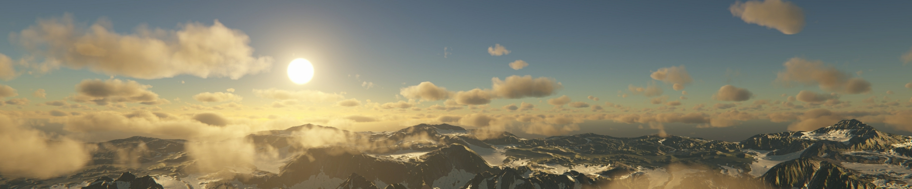

UnityPhysicallyBasedSkyURP
=============
 
 
 
 Physically Based Sky and Precomputed Atmospheric Scattering for Unity URP (Universal Render Pipeline).
 
 **Please read the Documentation and Requirements before using this repository.**

Features
------------
- Physically Based Sky
- Atmospheric Scattering
- Height-Based Fog
- Dynamic Sky Reflection
- Dynamic Ambient Lighting (PBSky only)
 
Installation
------------
- Please refer to [Unity's documentation page](https://docs.unity3d.com/Manual/upm-ui-giturl.html).
- Open the **Package Manager** and select **Add package from git URL** from the add menu.
- Enter **https://github.com/jiaozi158/UnityPhysicallyBasedSkyURP.git** to install this package.
- If Unity could not find **git**, consider installing it [here](https://git-scm.com/downloads).
- Add the **Physically Based Sky URP** renderer feature into the active URP renderer.
- Add the **Sky/Visual Environment (URP)** override to the scene's Volume.
- Add the **Sky/Physically Based Sky (URP)** override to the scene's Volume.
- Add the **Sky/Fog (URP)** override to the scene's Volume.
 
Documentation
------------
- [Physically Based Sky Documentation](./Documentation~/Documentation.md)
 
Requirements
------------
- Unity 2022.3 (URP 14) or higher.
- Shader model 3.5 or higher (at leaset OpenGL ES 3.0 or equivalent).
- Perspective Projection Camera.
 
Reminders
------------
- Please open an issue if anything went wrong.
 
License
------------
MIT

